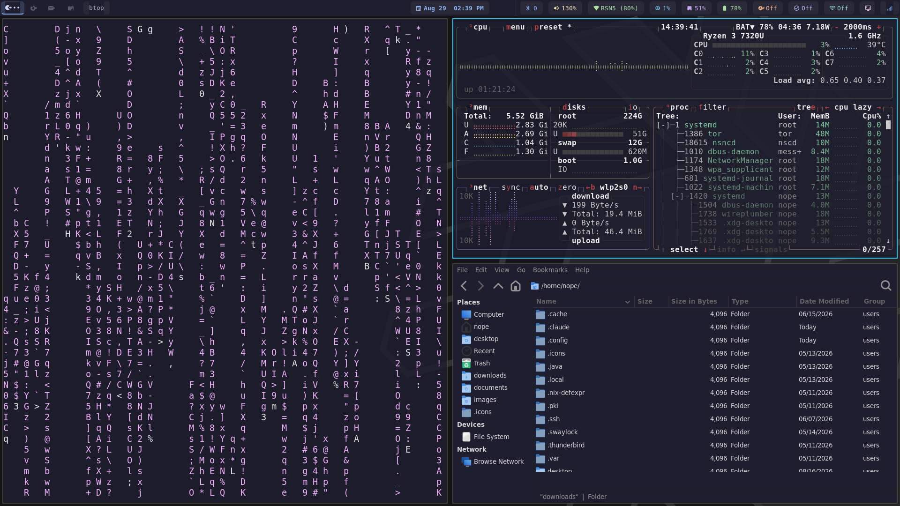

# NixOS Config — Lenovo IdeaPad 82VG



NixOS 25.11 configuration for a Lenovo IdeaPad 82VG running Hyprland on Wayland.

## Hardware

| Component | Spec |
|-----------|------|
| CPU | AMD Ryzen 3 7320U (4c/8t) |
| RAM | 5.5 GB |
| GPU | AMD Radeon 610M (integrated) |
| Storage | 238.5 GB SK Hynix NVMe SSD |
| WiFi | Realtek rtw89_8852be |
| OS | NixOS 25.11 |

Storage is LUKS encrypted with ext4. zram swap enabled to compensate for limited RAM.

## Desktop Environment

- **Window Manager:** Hyprland (Wayland, master layout)
- **Status Bar:** Waybar — Catppuccin Mocha theme
- **Launcher:** Wofi
- **Terminal:** Foot
- **Notifications:** Mako (bottom-right)
- **Lock Screen:** Swaylock
- **Login:** SDDM with Catppuccin Mocha Mauve theme, auto-login
- **File Manager:** Thunar
- **Theme:** Catppuccin Mocha throughout (GTK, waybar, wofi, mako, foot)
- **Cursor:** Adwaita
- **Fonts:** JetBrains Mono Nerd Font, Font Awesome

## Waybar Widgets

Left to right:
- Hyprland workspace indicators (with per-workspace window count dots)
- Active window title
- *(center)* Date + clock
- Airplane mode toggle
- Bluetooth
- Volume
- Network (WiFi)
- CPU / Memory / Battery
- OpenVPN status/toggle
- Tor transparent proxy toggle
- Twingate VPN toggle
- Screenshot (left click = full screen, right click = region)
- System tray

## Keybindings

| Key | Action |
|-----|--------|
| `Super + Return` | Open terminal (foot) |
| `Super + D` | App launcher (wofi) |
| `Super + Shift + Q` | Close window |
| `Super + F` | Fullscreen |
| `Super + Shift + Space` | Toggle floating |
| `Super + Space` | Cycle next window |
| `Super + L` | Lock screen |
| `Super + N` | Network reset (panic button) |
| `Super + R` | Resize mode |
| `Super + Shift + E` | Exit Hyprland (with confirm) |
| `Super + 1-4` | Switch workspace |
| `Super + Shift + 1-4` | Move window to workspace |
| `Ctrl + Tab` | Next workspace |
| `Ctrl + Shift + Tab` | Previous workspace |
| `Alt + Tab` | Cycle windows |
| `Print` | Full screenshot |
| `Super + Print` | Region screenshot |

## Power / Sleep

| Idle Time | Action |
|-----------|--------|
| 10 min | Lock screen |
| 20 min | Display off |
| 30 min | Suspend |
| 60 min | Hibernate |
| Lid close | Suspend → hibernate after 30 min |

Uses `systemctl suspend-then-hibernate` with `HibernateDelaySec=1800`.

## Security Tools

Metasploit, Burp Suite, sqlmap, THC Hydra, John the Ripper, Wireshark, Nmap, nmapAutomator, Netdiscover, Sherlock, theHarvester, PentestGPT, Tor (transparent proxy via iptables)

## Repo Structure

```
configuration.nix          — main NixOS system config
hardware-configuration.nix — auto-generated hardware config
.zshrc                     — zsh config (Oh My Zsh, agnoster theme)
hypr/                      — Hyprland config
waybar/                    — waybar config and Catppuccin theme
foot/                      — foot terminal config
wofi/                      — wofi launcher config
mako/                      — mako notification config
gtk3-custom.css            — GTK3 overrides (opaque backgrounds)
ssh-config                 — SSH client config
claude-memory/             — Claude Code memory files
```

## Notable Fixes

- **WiFi disconnects:** `rtw89_core disable_ps_mode=Y` via `boot.extraModprobeConfig`
- **AMD GPU suspend crash:** `amdgpu.runpm=0` kernel parameter
- **Slow file dialogs:** xdg-portal with hyprland + gtk portals
- **GTK transparent backgrounds:** `gtk.css` with `window, window * { background-color: #1e1e2e; }`
- **TERM scrambling over SSH:** `SetEnv TERM=xterm-256color` in SSH config
