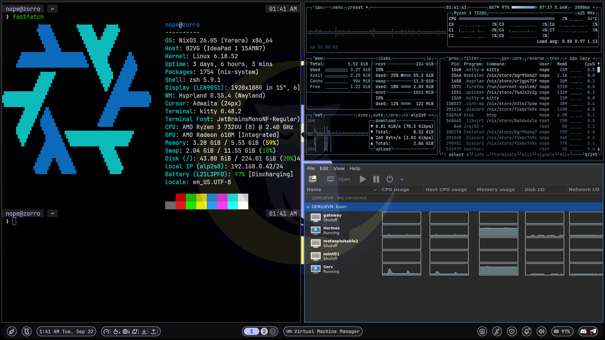
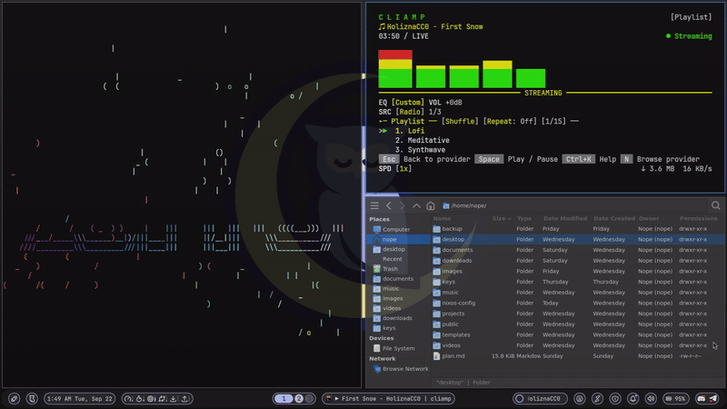

# NixOS Config — Lenovo IdeaPad 82VG (zorro)

NixOS 26.05 configuration for a Lenovo IdeaPad 82VG running Hyprland on Wayland. Hostname: **zorro**.





## Hardware

| Component | Spec |
|-----------|------|
| CPU | AMD Ryzen 3 7320U (4c/8t) |
| RAM | 5.5 GB |
| GPU | AMD Radeon 610M (integrated) |
| Storage | 238.5 GB SK Hynix NVMe SSD |
| WiFi | Realtek rtw89_8852be |
| OS | NixOS 26.05 |

Storage is LUKS encrypted with ext4. zram swap enabled to compensate for limited RAM.

## Desktop Environment

- **Window Manager:** Hyprland (Wayland, master layout)
- **Shell (bar, launcher, notifications, idle/DPMS, lock screen, wallpaper):** [noctalia-shell](https://github.com/noctalia-dev/noctalia-shell) — a Quickshell-based desktop shell. Stock theme, no custom theming layered on top; replaces the previous hand-themed waybar/wofi/mako/hyprlock/swaybg stack.
- **Terminal:** Kitty (custom cursor trail effect)
- **Login:** SDDM, auto-login, stock theme
- **File Manager:** Thunar
- **Cursor:** Adwaita
- **Fonts:** JetBrains Mono Nerd Font, Font Awesome, Noto Sans Mono CJK JP
- **Shell:** Zsh + Oh My Zsh (agnoster theme), fzf (Ctrl+R history, Ctrl+T file picker), zoxide (`z` smart directory jumping), zsh-autocomplete (↑/↓ live history/completion list)

## Bar Widgets (custom plugins)

noctalia-shell's default bar layout covers workspaces, active window, clock, network, bluetooth, audio, battery/power, and tray out of the box. Three custom plugins add the toggles this machine actually needs, under `noctalia-plugins/`:

- **`vpn-toggle`** — status + click-to-toggle for OpenVPN (`vpn-on`/`vpn-off`/`vpn-status` scripts; if multiple `.ovpn` files are present it just connects to the most recently modified one — no dmenu-style picker is installed since the noctalia-shell migration)
- **`tor-toggle`** — status + click-to-toggle for the Tor transparent proxy (`tor-on`/`tor-off`/`tor-status`)
- **`twingate-toggle`** — status + click-to-toggle for Twingate (`systemctl start/stop twingate`)

Each plugin is a `manifest.json` + `BarWidget.qml` pair, installed by symlinking into `~/.config/noctalia/plugins/`. `~/.config/noctalia/plugins.json` and `settings.json` also symlink back into `noctalia-config/` here.

## Keybindings

| Key | Action |
|-----|--------|
| `Super + Return` | Open terminal (kitty) |
| `Super + D` | App launcher (noctalia) |
| `Super + Shift + Q` | Close window |
| `Super + F` | Fullscreen |
| `Super + Shift + Space` | Toggle floating |
| `Super + Space` | Cycle next window |
| `Super + M` | Swap focused window to master |
| `Super + L` | Lock screen (noctalia) |
| `Super + N` | Network reset (panic button) |
| `Super + R` | Resize mode |
| `Super + Shift + E` | Exit Hyprland |
| `Super + 1-3` | Switch workspace |
| `Super + Shift + 1-3` | Move window to workspace |
| `Ctrl + Tab` | Next non-empty workspace |
| `Ctrl + Shift + Tab` | Previous non-empty workspace |
| `Alt + Tab` | Cycle windows |
| `Print` | Full screenshot |
| `Super + Print` | Region screenshot |

## Power / Sleep

| Idle Time | Action |
|-----------|--------|
| 30 min | Suspend (battery only — skipped on AC) |
| Lid close (battery) | Suspend → hibernate after 24h |
| Lid close (AC) | Suspend only |

Screen dim/DPMS and idle lock are handled by noctalia-shell itself; the 30-minute suspend trigger is a minimal `swayidle` instance kept solely for that purpose. Uses `systemctl suspend-then-hibernate` with `HibernateDelaySec=24h`.

### Battery Thresholds (UPower)

| Battery | Action |
|---------|--------|
| 20% | Low warning |
| 10% | Critical warning |
| 5% | Hibernate |

## Security Tools

**Exploitation:** Metasploit, Burp Suite, sqlmap, impacket, netexec

**Password:** THC Hydra, John the Ripper, hashcat

**Network:** Nmap, masscan, netcat, Wireshark, wirelesstools, aircrack-ng, nmapAutomator, Netdiscover, dnsrecon, enum4linux, smbmap, smtp-user-enum

**Web:** gobuster, ffuf, nikto, nuclei

**OSINT / Recon:** recon-ng (with API keys), amass, subfinder, Sherlock, theHarvester, PentestGPT

**Wordlists:** SecLists

**Reverse Engineering:** Ghidra, binwalk

**Other:** exploitdb (searchsploit), proxychains-ng, Tor (transparent proxy), openvpn, Twingate

## File Sharing

`~/public/` is shared via two methods, restricted to `192.168.0.0/24` only:

| Method | Access |
|--------|--------|
| HTTP | `http://zorro/` — directory listing, browser-friendly |
| SMB | `\\zorro\public` or `smb://zorro/public` — read-only, no password |

Drop files in `~/public/` and they're immediately available to anyone on the LAN. Ports 80, 139, 445, 137, 138 are firewalled to LAN subnet only — dropped silently from outside.

## Performance & Storage

- **TRIM:** `services.fstrim.enable = true` — weekly TRIM for SSD health
- **Nix store optimisation:** `nix.optimise.automatic = true` — periodic hard-link dedup to save space
- **Nix GC:** `nix.gc.automatic = true` — weekly, deletes generations older than 3 days
- **Nix build limits:** `max-jobs = 2`, `cores = 2` — prevents builds from exhausting RAM
- **Journal cap:** `SystemMaxUse=200M` via `services.journald.extraConfig`
- **zram algorithm:** `zstd` — better compression ratio than default `lzo-rle`, fits more in swap
- **Swappiness:** `vm.swappiness = 100` — uses zram aggressively before evicting file cache
- **TCP BBR:** `net.ipv4.tcp_congestion_control = bbr` — better throughput on WiFi/VPN
- **IRQ balance:** `services.irqbalance.enable = true` — distributes interrupts across all 4 cores
- **CPU driver:** `amd-pstate-epp` (active by default on Zen 4) — hardware P-state management
- **NVMe scheduler:** `none` (kernel default for NVMe) — drive handles its own queuing
- **Boot time:** `serial8250.nr_uarts=0` kernel param — eliminates ~50s serial port timeout on boot
- **Firefox VA-API:** `media.ffmpeg.vaapi.enabled` + `LIBVA_DRIVER_NAME=radeonsi` — AMD GPU hardware video decoding
- **Zsh startup:** fzf/zoxide/seclists init results cached to `~/.cache/` — ~275ms startup vs ~330ms uncached

## Repo Structure

```
configuration.nix          — main NixOS system config
hardware-configuration.nix — auto-generated hardware config
.zshrc                     — zsh config (Oh My Zsh, fzf, zoxide, noctalia-themed prompt)
hypr/                      — Hyprland config
kitty/                     — terminal config (Nord palette)
qt/                        — qt5ct/qt6ct config + Nord color scheme, themes Qt apps (Wireshark, etc.)
noctalia-config/           — noctalia-shell settings.json / plugins.json
noctalia-plugins/          — custom vpn/tor/twingate bar-widget plugins for noctalia-shell
noctalia-ipc               — helper for calling into the running noctalia-shell (launcher, lock screen)
launch-screensaver         — spawns the fullscreen kitty screensaver, called by noctalia's idle system
screensaver                — the screensaver itself (terminaltexteffects animation over the hostname)
dismiss-screensaver        — noctalia idle resumeCommand: signals the screensaver's pidfile on activity
net-reset                  — panic button (Super+N): kills Tor/Twingate, restarts NetworkManager
workspace-cycle            — Ctrl+Tab/Ctrl+Shift+Tab: cycle workspaces, skipping empty ones
ssh-config                 — SSH client config
vpn-on/off/status/toggle   — OpenVPN connect/status scripts
tor-on/off/status/toggle   — Tor transparent proxy scripts
twingate-status/toggle     — Twingate systemctl status/toggle scripts
claude-memory/             — Claude Code memory files
```

## Notable Fixes

- **WiFi disconnects:** `rtw89_core disable_ps_mode=Y` via `boot.extraModprobeConfig`, plus `networking.networkmanager.wifi.powersave = false`
- **AMD GPU suspend crash:** `amdgpu.runpm=0` kernel parameter
- **Slow file dialogs:** xdg-portal with hyprland + gtk portals
- **TERM scrambling over SSH:** `SetEnv TERM=xterm-256color` in SSH config
- **Serial port boot delay:** `serial8250.nr_uarts=0` kernel param — without it, kernel probes non-existent serial ports and times out (~50s)
- **Metasploit DB init:** msfdb conflicts with system PostgreSQL on port 5432 — remove `~/.msf4/db` and set msf user password via `sudo -u postgres psql`
- **Metasploit DB collation after upgrade:** after a PostgreSQL upgrade run `ALTER DATABASE msf_database REFRESH COLLATION VERSION;`
- **Apache 403 on ~/public:** nixos-rebuild resets `/home/nope` to 700 — fixed via `system.activationScripts.homeTraversable`
- **NixOS 26.05 upgrade — Hyprland 0.55 breaking changes:** `windowrulev2` removed; new `windowrule` format is space-separated without comma (`windowrule = workspace 2 class:firefox`); `noanim` replaced by `animation none`; `systemd.sleep.extraConfig` replaced by `systemd.sleep.settings.Sleep`
- **NixOS 26.05 upgrade — Samba:** services renamed from `smbd`/`nmbd` to `samba-smbd`/`samba-nmbd`
- **NixOS 26.05 upgrade — pipx:** broken test suite in nixpkgs 26.05, removed from config until fixed upstream
- **`nixos-upgrade.service` failing with exit 4/NOPERMISSION:** the new Rust `switch-to-configuration` needs to reach the logged-in user's runtime dir to reload user units, which isn't reliable from the timer's detached background context unless lingering is enabled — fixed via `users.users.nope.linger = true`
- **Tor toggle silently opening SMB/HTTP to the world:** `tor-on`/`tor-off` flush the whole iptables filter table (`iptables -F`), which also wipes the LAN-only scoping on ports 80/139/445/137/138 — nothing re-applied it until reboot. Both scripts now run `systemctl restart firewall` right after the flush.
- **Twingate not auto-starting despite `twingate setup` asking to enable it:** that prompt only affects Twingate's own internal config; boot behavior is actually governed by `systemd.services.twingate.wantedBy = mkForce []` here, which deliberately keeps it manual (toggle via bar widget)
- **Up/Down arrow only doing plain history recall instead of zsh-autocomplete's live list:** `.zshrc` had explicit `bindkey '^[[A'/'^[[B' history-substring-search-up/down` calls left over from before `zsh-autocomplete` was added to `programs.zsh.ohMyZsh.customPkgs`; sourced after Oh My Zsh, they silently clobbered zsh-autocomplete's own arrow-key bindings. Removed — zsh-autocomplete now owns Up/Down.
- **Screensaver leaking raw escape-sequence bytes into the terminal:** noctalia's idle `resumeCommand` was empty, so the screensaver only self-dismissed on a keypress landing in its own focused window; its dismiss check also read only 1 byte (`read -n 1`), so the first byte of a multi-byte key (e.g. an arrow key's `ESC`) triggered exit while the remaining bytes (`[A`) stayed unread and could surface as literal characters wherever focus went next. Fixed via `dismiss-screensaver` (a real `resumeCommand` that signals the screensaver's own pidfile) plus draining any leftover input and `stty sane` in its exit trap.
